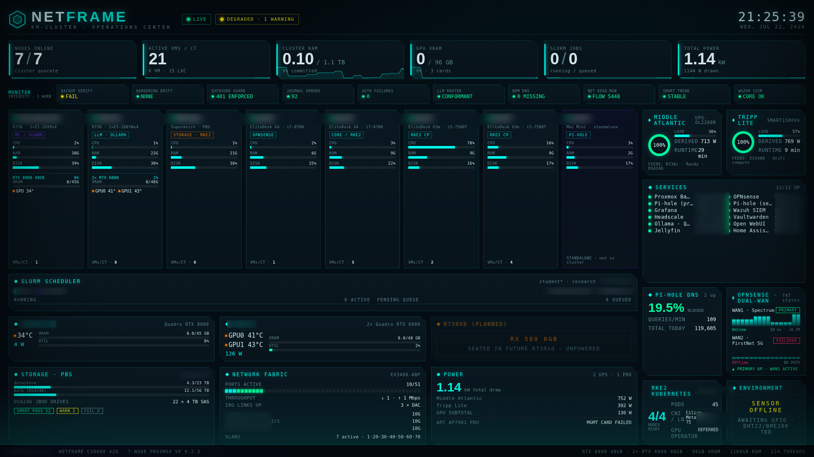

# NetFRAME — a self-hosted homelab wall dashboard

A single-page, cyberpunk **operations dashboard** for a homelab cluster, driven by a
tiny zero-dependency Python aggregator and shown full-screen on a Raspberry Pi kiosk.

It pulls **live** data from everything you already run — Prometheus, your monitoring
scripts, SLURM, Kubernetes, Pi-hole, your firewall, your switch — merges it into one
snapshot, and paints a wall display that actually tells you when something is wrong.



> **This is a build-it-yourself guide.** All infrastructure specifics (IPs, hostnames)
> are placeholders like `HV1`, `192.168.X.X`, `GPU_HOST`. Search the doc for
> `# CONFIGURE` markers — those are the only things you change for your own lab.

---

## Table of contents
1. [What it is](#1-what-it-is)
2. [Architecture](#2-architecture)
3. [How the pieces talk](#3-how-the-pieces-talk-data-flow)
4. [Prerequisites](#4-prerequisites)
5. [Quick start](#5-quick-start-get-it-on-a-screen-in-5-minutes)
6. [`serve.py` — the aggregator, explained](#6-servepy--the-aggregator-explained)
7. [`netframe-dashboard.html` — the UI, explained](#7-netframe-dashboardhtml--the-ui-explained)
8. [Wiring your data sources](#8-wiring-your-data-sources)
9. [Deploying to a Raspberry Pi kiosk](#9-deploying-to-a-raspberry-pi-kiosk)
10. [Least-privilege access (recommended)](#10-least-privilege-access-recommended)
11. [Security model](#11-security-model)
12. [Troubleshooting (the gotchas)](#12-troubleshooting-the-gotchas-we-actually-hit)
13. [License](#13-license)

---

## 1. What it is

Two files do all the work:

| File | Role |
|---|---|
| **`serve.py`** | A ~400-line **stdlib-only** HTTP server. Serves the page, and every ~5 s a background thread rebuilds one JSON snapshot (`/api/state`) by querying all your sources concurrently. Serves last-good data if a source hiccups, so the wall never blanks. |
| **`netframe-dashboard.html`** | The entire UI in one self-contained file (inline CSS + JS, no build step, no external requests). Polls `/api/state`; falls back to animated mock data if the aggregator is unreachable, so the file also works opened directly. |

**Design goals:** zero dependencies (Python 3 stdlib + a browser), zero build step,
no secrets in the code, safe-by-default (read-only everywhere), and a display that
survives reboots and source outages.

**Features**
- Live node CPU/RAM/disk, GPU power/temp, UPS, Pi-hole, dual-WAN, SLURM, Kubernetes, switch, and a "monitor integrity" strip
- A **severity-aware header** (`NOMINAL` / `DEGRADED · N` / `CRITICAL · N`) computed from real state
- **Reactive flash** — tiles pulse red the instant something goes critical
- **Trend sparklines** behind each KPI (rolling client-side history)
- Pixel-locked 1920×1080, auto-scaled to any screen

---

## 2. Architecture

```
                        ┌──────────────────────────────────────────┐
   THE WALL (Pi)        │  Raspberry Pi 4  (Pi OS Lite)            │
                        │                                          │
                        │  cage (Wayland kiosk) → Chromium --kiosk │
                        │        │  http://localhost:8088          │
                        │        ▼                                 │
                        │  serve.py  (systemd, :8088)              │
                        │        │  builds /api/state every ~5s    │
                        └────────┼─────────────────────────────────┘
                                 │  (read-only, over your LAN)
        ┌────────────────────────┼──────────────────────────────────┐
        ▼            ▼           ▼            ▼           ▼           ▼
   Prometheus   monitor.json   SLURM       Kubernetes   Pi-hole    OPNsense
   (node/gpu/   (integrity,    (squeue,    (read-only   (v6 API)   (API:
    ups/snmp)    services)      sinfo)      SA token)               gateways,
                                                                    WANs, states)
```

The aggregator is the **only** thing that talks to your infrastructure. The browser
only ever talks to `serve.py`. That single choke point is what makes it safe to put a
credential-holding device on a wall (see [§10](#10-least-privilege-access-recommended)).

---

## 3. How the pieces talk (data flow)

1. **Browser** loads `netframe-dashboard.html` from `serve.py`.
2. Every 3 s the page does `fetch('/api/state')`.
3. **`serve.py`** returns the latest cached snapshot (rebuilt by a background thread
   every ~5 s, so a fetch never waits on your infrastructure).
4. The page **merges** the snapshot into its in-memory `DATA` object and re-renders.
5. If the fetch fails (aggregator down, or the file opened standalone), the page
   **falls back to mock data** and shows `OFFLINE` — it never goes blank.

The snapshot is intentionally flat and per-panel, e.g.:
```json
{
  "ok": true, "ts": 1730000000.0,
  "sources": {"prometheus": true, "monitor": true, "slurm": true, "k8s": true, ...},
  "nodes":   {"HV1": {"cpu": 12.3, "ramU": 41.0, "disk": 37.0, "st": "g"}, ...},
  "ups":     {"ups_a": {"load": 38, "batt": 100, "runtime": 41}},
  "integrity":[{"k": "Backup Verify", "v": "OK", "s": "g"}, ...],
  "opnsense": {"wan1": {"gw": "Online", "lat": 12.0, "down_bps": 1200000}, ...}
}
```
`s`/`st` are severity codes used everywhere: **`g`** good, **`y`** warn, **`r`** critical.

---

## 4. Prerequisites

- **Python 3.9+** on whatever runs `serve.py` (the Pi, or any always-on box). Stdlib only.
- A modern browser for the display (Chromium on the Pi).
- Whatever data sources you want to show. **None are mandatory** — `serve.py` skips a
  source that isn't configured, and the panel shows mock until it exists.
- For the sources this repo wires by default: SSH access to the relevant hosts (key-based),
  a Prometheus reachable somehow, and read-only API creds for Pi-hole/OPNsense.

---

## 5. Quick start (get it on a screen in 5 minutes)

```bash
git clone <this-repo> netframe-dashboard && cd netframe-dashboard
python3 serve.py 8088
# open http://localhost:8088
```

With nothing configured it serves the page and every panel runs on **mock data** (the
badge reads `OFFLINE`). That's your starting point — now wire real sources one at a time
in [§8](#8-wiring-your-data-sources), watching each panel flip to live.

---

## 6. `serve.py` — the aggregator, explained

### 6.1 The shape

```python
# CONFIGURE — map each source-host's hostname to the display name on its node card.
HOSTS = {"hv1": "HV1", "hv2": "HV2", "gpu-a": "GPU-A", "storage": "Storage", ...}

SSH = ["ssh", "-o", "BatchMode=yes", "-o", "ConnectTimeout=8",
       # multiplex: many concurrent queries to one host share ONE connection
       "-o", "ControlMaster=auto", "-o", "ControlPath=/tmp/nfm-cm-%r@%h:%p",
       "-o", "ControlPersist=60s"]
```
`SSH` is a reusable argv prefix. **ControlMaster is important**: the aggregator fires a
dozen+ SSH calls at once; without multiplexing they can exceed a host's `MaxStartups`
and silently drop (you'll see values randomly go to zero). One socket per host fixes it.

### 6.2 Credentials

Secrets live in a `600`-mode env file, **never** in the repo:
```python
def load_env(path="~/.config/netframe-dashboard.env"):
    # simple dotenv parse: KEY=VALUE, strip, drop one layer of matching quotes
```
```ini
# ~/.config/netframe-dashboard.env   (chmod 600)
PIHOLE_HOST=192.168.X.X
PIHOLE_PASSWORD=...
OPNSENSE_HOST=192.168.X.X
OPNSENSE_KEY=...
OPNSENSE_SECRET=...
K8S_API=https://192.168.X.X:6443
K8S_TOKEN=...
```

### 6.3 The concurrency core

```python
def build_state():
    st = {"ts": time.time(), "sources": {}}
    # prime one SSH master per host so the pool multiplexes over a single socket each
    for host in ("PROM_HOP", "MONITOR_HOST", "SLURM_HOST"):     # CONFIGURE
        sh(SSH + [host, "true"], timeout=10)

    tasks = {                              # every independent fetch, keyed
        "cpu":  lambda: prom_by('100 - (avg by(instance)(rate(node_cpu_seconds_total{mode="idle"}[2m]))*100)'),
        "ramU": lambda: prom_by('(1 - node_memory_MemAvailable_bytes/node_memory_MemTotal_bytes)*100'),
        ...
        "M":    monitor, "slurm": slurm, "k8s": k8s, "phs": pihole_stats, "opn": opnsense_stats,
    }
    R = {}
    with ThreadPoolExecutor(max_workers=len(tasks)) as ex:      # fan out
        futs = {k: ex.submit(fn) for k, fn in tasks.items()}
        for k, f in futs.items():
            try: R[k] = f.result(timeout=30)
            except Exception: R[k] = None                       # a dead source = None, never fatal
    # ...assemble R into the flat snapshot...
    st["ok"] = st["sources"].get("prometheus") or st["sources"].get("monitor")
    return st
```
Key ideas: **fan out** all fetches with a thread pool (turns ~15 s of serial SSH into
~5 s), and a source that throws simply becomes `None` and is skipped — one broken source
can never break the snapshot.

### 6.4 A background refresher + a dead-simple HTTP handler

```python
def refresher():
    global STATE
    while True:
        s = build_state()
        if s.get("ok"):
            with LOCK: STATE = s          # only replace on a usable build → serves last-good
        time.sleep(REFRESH)

class H(BaseHTTPRequestHandler):
    def do_GET(self):
        if path in ("/", "/index.html"):     ... serve the HTML file
        elif path == "/api/state":           ... return json.dumps(STATE)
        elif path == "/healthz":             ... return b"ok"
```

### 6.5 The source adapters (the interesting part)

Each adapter returns plain data or `None`. Swap these for your own sources.

**Prometheus over an SSH hop.** Many Prometheus installs bind to localhost. Instead of
exposing it, tunnel one query at a time through a host that can reach it:
```python
def prom(query):
    # PROM_HOP runs the curl where Prometheus is reachable (e.g. inside its container host)
    out = sh(SSH + ["PROM_HOP", "nfm-prom"], input=query)      # nfm-prom = a tiny wrapper, see §10
    return json.loads(out)["data"]["result"]

def prom_by(query, label="instance"):        # {instance: value}
    return {m["metric"].get(label): float(m["value"][1]) for m in prom(query)}
```

**A monitoring script's JSON.** If you already run a health-checker that emits JSON,
just read it and map its fields to integrity chips / service dots:
```python
def monitor():
    out = sh(SSH + ["MONITOR_HOST", "cat /path/to/last_run.json"])
    return json.loads(out)
# ...then integrity(M) / services(M) translate its checks into {k, v, s} chips.
```

**SLURM** via a wrapper that prints `sinfo` + `squeue` in a stable `-o` format:
```python
def slurm():
    out = sh(SSH + ["SLURM_HOST", "nfm-slurm"])
    # parse ===SINFO=== / ===SQUEUE=== sections into running/pending job lists
```

**Kubernetes** with a **read-only token** (no admin kubeconfig on a wall device):
```python
def k8s():
    api, tok = ENV.get("K8S_API"), ENV.get("K8S_TOKEN")
    if api and tok:                                   # token path (Pi)
        g = lambda p: json.load(urllib.request.urlopen(
              urllib.request.Request(api+p, headers={"Authorization": "Bearer "+tok}),
              timeout=10, context=_SSL))
        nodes = g("/api/v1/nodes")["items"]; pods = g("/api/v1/pods")["items"]
    else:                                             # fall back to local kubectl (dev box)
        ...
    ready = sum(1 for n in nodes for c in n["status"]["conditions"]
                if c["type"]=="Ready" and c["status"]=="True")
    gpus  = sum(int(n["status"]["allocatable"].get("nvidia.com/gpu",0)) for n in nodes)
    return {"nodes": len(nodes), "ready": ready, "pods": ..., "gpuop": "ACTIVE" if gpus else "DEFERRED"}
```

**Pi-hole v6** (session auth, then cached SID):
```python
def pihole_stats():
    # POST /api/auth {password} -> sid ; reuse sid until it 401s ; GET /api/stats/summary
    # returns blocked %, queries/min (delta between refreshes), total today
```

**OPNsense** (HTTP Basic with an API key/secret on a **read-only** user):
```python
def opnsense_stats():
    # GET interfaces/overview/export  -> per-WAN up/down + byte counters (rate-differenced -> Mbps)
    # GET diagnostics/firewall/pf_states -> connection-states count
    # GET routes/gateway/status       -> per-WAN Online/Offline, latency, loss (handles "~" on offline gw)
```

**A network switch via SNMP** (through a `snmp_exporter` you scrape in Prometheus):
```python
def switch():
    up  = prom_scalar('count(ifOperStatus{job="snmp-SW",ifName=~"(ge|xe|et)-[0-9/]+"} == 1)')
    ten = prom_scalar('count(ifOperStatus{job="snmp-SW",ifName=~"xe-[0-9/]+"} == 1)')
    inm = prom_scalar('sum(rate(ifHCInOctets{job="snmp-SW",...}[2m]))*8/1e6')  # Mbps
    ...
```

---

## 7. `netframe-dashboard.html` — the UI, explained

One file, three parts: **`<style>`** (theme + layout), **markup** (empty containers),
**`<script>`** (a `DATA` object + `render*()` functions + a poll loop).

### 7.1 The data model
Every panel reads from one object; there is no framework. Phase-2 wiring = swap the
object's source from mock to `fetch`, the render code never changes:
```js
const DATA = {
  nodes:[{host:'HV1', cpu:12, ramU:41, disk:37, st:'g', gpu:null}, ...],
  ups:[...], services:[...], integrity:[...], opnsense:{...}, gpus:[...], ...
};
```

### 7.2 Render + poll + graceful fallback
```js
function renderAll(){ renderSummary(); renderNodes(); renderIntegrity(); renderRail();
                      renderSlurm(); renderGpu(); renderBottom(); updateHeader(); }

async function pull(){
  try {
    const s = await (await fetch('/api/state',{cache:'no-store'})).json();
    if (!s.ok) throw 0;
    applyLive(s); updateMode(true, Date.now()/1000 - s.ts); renderAll();   // LIVE
  } catch { updateMode(false); mockTick(); }                                // OFFLINE → mock
}
setInterval(pull, 3000);
```
`applyLive(s)` merges snapshot fields into `DATA` (with `null` guards so a briefly-missing
value keeps its last reading). `mockTick()` jitters the mock values so a standalone file
still looks alive.

### 7.3 Severity, reactive flash, sparklines
```js
function computeOverall(){                 // worst-wins across integrity/services/nodes
  let crit=0, warn=0;
  DATA.integrity.forEach(c => c.s==='r'?crit++ : c.s==='y'&&warn++);
  ...
  return {crit, warn, level: crit?'crit':(warn?'warn':'ok')};
}
// header text/colour follows level; .node.crit / .ichip.crit get a red critpulse animation.

function sparkSVG(vals){ /* normalise vals → inline SVG area+line+endpoint */ }
// each KPI keeps a rolling KPIHIST[key] array; the sparkline is drawn behind the number.
```

### 7.4 Pixel-lock + auto-scale
The stage is a fixed `1920×1080` box; `fit()` scales it to the actual viewport and
centres it, so it's crisp at 1:1 on the wall and still fits any laptop:
```js
function fit(){
  const s = Math.min(innerWidth/1920, innerHeight/1080) * SAFE;   // SAFE=1; lower it if a monitor overscans
  stage.style.transform = `scale(${s})`;
  stage.style.marginLeft = ((innerWidth - 1920*s)/2)+'px'; ...
}
```
> **Overflow vs. overscan:** if content is clipped at an edge, it's almost always a panel
> spilling its box, not the monitor. Every panel has `overflow:hidden` and grid tracks use
> `minmax(0,1fr)` so a wide child can't shove a neighbour off-screen.

---

## 8. Wiring your data sources

The pattern for each: **(1)** point an adapter in `serve.py` at your source, **(2)** confirm
it appears in `/api/state`, **(3)** the panel goes live automatically.

```bash
# after editing an adapter:
python3 serve.py 8088 &
curl -s localhost:8088/api/state | python3 -m json.tool | less   # confirm the keys
```
Start with whatever you already have (Prometheus is the highest-leverage — node CPU/RAM/disk,
and often UPS/GPU/Pi-hole exporters too). Add the rest incrementally.

### Optional exporters this repo assumes
- **GPU:** `nvidia_gpu_exporter` (a static binary that wraps `nvidia-smi` — no driver
  packages, safe on a pinned driver). Systemd unit, `:9835`, scraped by Prometheus.
- **Switch:** `prometheus/snmp_exporter` (the default `if_mib` module) with a read-only
  SNMP community locked to the exporter's IP.

Both are added to Prometheus as normal scrape jobs; the aggregator then queries Prometheus.

---

## 9. Deploying to a Raspberry Pi kiosk

Pi OS **Lite** (headless) + this stack = a wall display that boots straight into the
dashboard. Two services:

**A. The data engine (systemd):**
```ini
# /etc/systemd/system/netframe-dashboard.service
[Service]
User=YOURUSER
Environment=HOME=/home/YOURUSER
ExecStart=/usr/bin/python3 /home/YOURUSER/netframe-dashboard/serve.py 8088
Restart=always
[Install]
WantedBy=multi-user.target
```

**B. The kiosk.** The reliable pattern on Pi OS Lite is **getty autologin → cage**, not a
systemd service (a service fights getty for the console). `sudo apt install cage chromium`, then:
```bash
# /etc/systemd/system/getty@tty1.service.d/autologin.conf
[Service]
ExecStart=
ExecStart=-/sbin/agetty --autologin YOURUSER --noclear %I $TERM
```
```bash
# ~/.bash_profile  (runs ONLY on the physical console)
if [ "$(tty)" = "/dev/tty1" ] && [ -z "$WAYLAND_DISPLAY" ]; then
  # cage must target the DRM card with the connected HDMI (Pi4: vc4, not the v3d render node)
  for s in /sys/class/drm/card*-HDMI*/status; do
    [ "$(cat "$s" 2>/dev/null)" = connected ] && \
      export WLR_DRM_DEVICES="/dev/dri/$(basename "$(dirname "$s")" | sed 's/-HDMI.*//')" && break
  done
  until curl -sf http://localhost:8088/healthz >/dev/null 2>&1; do sleep 2; done
  exec cage -s -d -- chromium --kiosk --ozone-platform=wayland \
       --noerrdialogs --disable-infobars --app=http://localhost:8088
fi
```
Three details that will bite you if you skip them are called out in
[§12](#12-troubleshooting-the-gotchas-we-actually-hit). Wired ethernet is best for a
24/7 wall; for WiFi, join an SSID on a VLAN that can actually reach your data sources.

---

## 10. Least-privilege access (recommended)

A wall-mounted Pi is physically reachable, so give it the **minimum** and nothing more.

**Forced-command SSH wrappers.** Instead of giving the Pi's key a shell on your hosts,
authorize it to run exactly one read-only command. Example `nfm-prom` on the Prometheus hop:
```sh
#!/bin/sh
# reads a PromQL query on stdin, runs ONE read-only instant query, returns JSON
q=$(cat)
exec <your prometheus curl> --data-urlencode "query=$q"
```
```
# in that host's authorized_keys, the Pi key is pinned to the wrapper:
command="/usr/local/sbin/nfm-prom",no-agent-forwarding,no-port-forwarding,no-pty ssh-ed25519 AAAA... pi-key
```
Now that key **cannot get a shell** — `ssh HOST anything` only ever runs the wrapper.
Do the same for the monitor read (`command="cat /path/last_run.json"`) and SLURM (`nfm-slurm`).

**Read-only Kubernetes token** instead of an admin kubeconfig:
```yaml
kind: ClusterRole            # get/list nodes + pods, nothing else
rules: [{apiGroups:[""], resources:["nodes","pods"], verbs:["get","list"]}]
# bind to a ServiceAccount, mint a long-lived token Secret, put it in the env as K8S_TOKEN
```
Verify it's read-only: a `DELETE` against the API returns **403**.

**Read-only API users** for Pi-hole (a scoped app password) and OPNsense (an API key on a
user with only the `Status:`/`Diagnostics:` view privileges you need).

Net result: the wall device holds **no admin credentials** — only revocable, read-only,
command-pinned access.

---

## 11. Security model

- **The browser never touches infrastructure** — only `serve.py`. One auditable choke point.
- **No secrets in the repo.** All creds live in `~/.config/netframe-dashboard.env` (`600`),
  which is `.gitignore`d. The page and `serve.py` contain none.
- **Everything read-only** — forced-command wrappers, a read-only k8s token, read-only API
  users. Nothing the dashboard can reach can change your infrastructure.
- **Fail-safe** — a dead source becomes `None`; the aggregator serves last-good; the page
  falls back to mock. No blank walls, no crashes.

---

## 12. Troubleshooting (the gotchas we actually hit)

| Symptom | Cause / fix |
|---|---|
| Values randomly drop to 0 | Too many concurrent SSH connections → host `MaxStartups`. **Use SSH `ControlMaster` multiplexing** (already in the `SSH` prefix). |
| Kiosk "flashing prompt" loop | The wait-for-dashboard step used `curl`, which isn't on Pi OS Lite → the check hung. `apt install curl` (or use a `python3` probe). |
| cage runs, screen stays on the console | cage grabbed the **wrong DRM card** (the v3d render node has no outputs). Set `WLR_DRM_DEVICES` to the card whose `.../cardN-HDMI-*/status` is `connected`. |
| cage runs, Chromium runs, but nothing draws | Chromium needs **`--ozone-platform=wayland`** to render onto the Wayland compositor. |
| Right column clipped at the edge | Not overscan — a **panel spilling its box**. Ensure `overflow:hidden` on panels and `minmax(0,1fr)` on grid tracks. |
| WiFi connects but every panel goes mock | The Pi joined a **VLAN that can't reach your data sources** (e.g. IoT/guest). Use an SSID on your management/trusted VLAN. |
| Clock is wrong | The clock uses the **browser's timezone** = the Pi's system timezone. `sudo timedatectl set-timezone Area/City`. |

---

## 13. License

MIT — do whatever you like. If it ends up on your wall, that's payment enough. 🛰️
