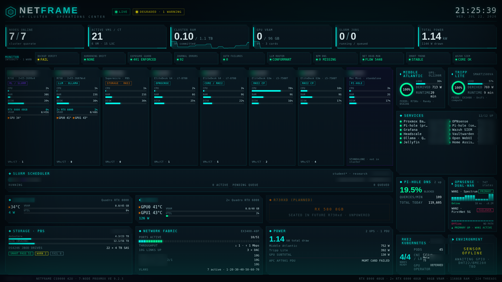

# NetFRAME Dashboard

A **real-time operations wall display** for a 7-node Proxmox cluster, driven by a
zero-dependency Python aggregator and shown full-screen on a kiosk.

It merges live state from Prometheus, SLURM, Kubernetes, Pi-hole, the firewall and the
switch into a single snapshot, and paints a display that tells an operator when something
is wrong. **Read-only by design:** it observes production and cannot change it.



> **This doubles as a build guide.** All infrastructure specifics (IPs, hostnames) are
> placeholders like `HV1`, `192.168.X.X`, `GPU_HOST`. Search the doc for `# CONFIGURE`
> markers — those are the only values that change for a different estate.

---

## Table of contents
1. [What it is](#1-what-it-is)
2. [Architecture](#2-architecture)
3. [How the pieces talk](#3-how-the-pieces-talk-data-flow)
4. [Prerequisites](#4-prerequisites)
5. [Quick start](#5-quick-start-get-it-on-a-screen-in-5-minutes)
6. [`serve.py` — the aggregator, explained](#6-servepy--the-aggregator-explained)
7. [`netframe-dashboard.html` — the UI, explained](#7-netframe-dashboardhtml--the-ui-explained)
8. [Wiring your data sources](#8-wiring-your-data-sources)
9. [Deploying to a Raspberry Pi kiosk](#9-deploying-to-a-raspberry-pi-kiosk)
10. [Least-privilege access (recommended)](#10-least-privilege-access-recommended)
11. [Security model](#11-security-model)
12. [Troubleshooting (the gotchas)](#12-troubleshooting-the-gotchas-we-actually-hit)
13. [License](#13-license)

---

## 1. What it is

Two files do all the work:

| File | Role |
|---|---|
| **`serve.py`** | A **stdlib-only** HTTP server. Serves the page, and a background thread rebuilds one JSON snapshot (`/api/state`) by querying all your sources concurrently: it sleeps `REFRESH` = 30 s between builds, so with build time a new snapshot lands roughly every 40 s. A source that fails is carried forward per panel as `STALE` with the age of its last real observation (never re-aged, never relabelled fresh). |
| **`/api/proposals`** | A **third** separate endpoint carrying `netframe-proposal-dashboard-feed/v2` - which incident proposals Jarvis has prepared and is waiting on an owner for, from either source. v2 carries a typed `source_kind` (prometheus/wazuh) and `source_condition` (FIRING/CLEARED/DETECTION_RECORDED): a Wazuh archive event happened once and does not later clear, so it is never rendered as a firing or cleared alert. Awareness only: the wall has no accept, dismiss, publish or select path, and a count is shown only when the intake collector could actually see. Point a consumer at another host's feed with `NFM_PROPOSAL_FEED_URL`; leave it unset to read the local projection (`NFM_PROPOSAL_FEED_FILE`). Neither is a secret. |
| **`/api/incident`** | A **second, separate** endpoint carrying `netframe-live-dashboard-feed/v1` - the live incident projection NetFRAME produces. The dashboard never collects incident evidence: one producer on Ares runs Live Incident Mode and writes the feed, this endpoint moves the bytes, and the panel renders them. Acquisition runs on its own thread with its own lock, so an unreachable feed degrades one strip and never `/api/state`. Point a consumer at another host's feed with `NFM_INCIDENT_FEED_URL`; leave it unset to read the local producer's file (`NFM_INCIDENT_FEED_FILE`). Neither is a secret. |
| **`netframe-dashboard.html`** | The entire UI in one self-contained file (inline CSS + JS, no build step, no external requests). Polls `/api/state`, `/api/incident` and `/api/proposals` independently. **It never simulates a value:** if the aggregator is unreachable it keeps the last real sample, dimmed under a `NO CARRIER` flag with an advancing age. Sample data exists only behind `?demo=1`, under a full-screen DEMO watermark. |

**Design goals:** zero dependencies (Python 3 stdlib + a browser), zero build step,
no secrets in the code, safe-by-default (read-only everywhere), and a display that
**says when its information is invalid** instead of looking healthy.

**Features**
- Live node CPU/RAM/disk, GPU power/temp, UPS (incl. on-line / on-battery), Pi-hole, dual-WAN posture, SLURM, Kubernetes, switch, and a "monitor integrity" strip
- **Four status lamps** with four sources — INFRASTRUCTURE, TELEMETRY CONFIDENCE, INCIDENT, OWNER REVIEW · SECURITY (§7.3)
- A **NEEDS ATTENTION** list: one line per independent condition, worst first, never an inferred cause
- **Reactive flash** — tiles pulse red the instant something goes critical; healthy equipment glows steady
- Cyberpunk HUD styling (scanlines, scan beam, neon glow) tuned so decoration never imitates a warning
- Pixel-locked 1920×1080, auto-scaled to any screen

---

## 2. Architecture

```
                        ┌──────────────────────────────────────────┐
   THE WALL (Pi)        │  Raspberry Pi 4  (Pi OS Lite)            │
                        │                                          │
                        │  cage (Wayland kiosk) → Chromium --kiosk │
                        │        │  http://localhost:8088          │
                        │        ▼                                 │
                        │  serve.py  (systemd, :8088)              │
                        │        │  builds /api/state every ~40s   │
                        └────────┼─────────────────────────────────┘
                                 │  (read-only, over your LAN)
        ┌────────────────────────┼──────────────────────────────────┐
        ▼            ▼           ▼            ▼           ▼           ▼
   Prometheus   monitor.json   SLURM       Kubernetes   Pi-hole    OPNsense
   (node/gpu/   (integrity,    (squeue,    (read-only   (v6 API)   (API:
    ups/snmp)    services)      sinfo)      SA token)               gateways,
                                                                    WANs, states)
```

The aggregator is the **only** thing that talks to your infrastructure. The browser
only ever talks to `serve.py`. That single choke point is what makes it safe to put a
credential-holding device on a wall (see [§10](#10-least-privilege-access-recommended)).

---

## 3. How the pieces talk (data flow)

1. **Browser** loads `netframe-dashboard.html` from `serve.py`.
2. Every 3 s the page does `fetch('/api/state')` (one request in flight at a time, 8 s
   timeout); `/api/incident` and `/api/proposals` are polled every 5 s on their own.
3. **`serve.py`** returns the latest cached snapshot (rebuilt by a background thread
   about every 40 s, so a fetch never waits on your infrastructure).
4. The page builds a model **only from the snapshot**: anything it does not carry is
   `null` and renders as `—` / NOT MEASURED. A response from an older request is
   dropped; a snapshot whose `ts` did not move forward is not a new sample.
5. If the fetch fails twice (or nothing good arrives for 10 s), the page shows
   `NO CARRIER` over the last real values, dimmed, with their age still counting.
   Before the first sample it shows `ACQUIRING SIGNAL`. It never invents numbers.

The snapshot is intentionally flat and per-panel, e.g.:
```json
{
  "ok": true, "ts": 1730000000.0,
  "sources": {"prometheus": true, "monitor": true, "slurm": true, "k8s": true, ...},
  "nodes":   {"HV1": {"cpu": 12.3, "ramU": 41.0, "disk": 37.0, "st": "g"}, ...},
  "ups":     {"ups_a": {"load": 38, "batt": 100, "runtime": 41}},
  "integrity":[{"k": "Backup Verify", "v": "OK", "s": "g"}, ...],
  "opnsense": {"wan1": {"gw": "Online", "lat": 12.0, "down_bps": 1200000}, ...}
}
```
`s`/`st` are severity codes used everywhere: **`g`** good, **`y`** warn, **`r`** critical.

---

## 4. Prerequisites

- **Python 3.9+** on whatever runs `serve.py` (the Pi, or any always-on box). Stdlib only.
- A modern browser for the display (Chromium on the Pi).
- Whatever data sources you want to show. **None are mandatory** — `serve.py` skips a
  source that isn't configured, and the panel reads NOT REPORTED until it exists.
- For the sources this repo wires by default: SSH access to the relevant hosts (key-based),
  a Prometheus reachable somehow, and read-only API creds for Pi-hole/OPNsense.

---

## 5. Quick start (get it on a screen in 5 minutes)

```bash
git clone <this-repo> netframe-dashboard && cd netframe-dashboard
python3 serve.py 8088
# open http://localhost:8088
```

With nothing configured it serves the page and every panel reads `NOT REPORTED` /
`NO DATA` (sources are `MISSING`). Open `http://localhost:8088/?demo=1` to see a
watermarked sample layout. Then wire real sources one at a time in
[§8](#8-wiring-your-data-sources), watching each panel flip to live.

---

## 6. `serve.py` — the aggregator, explained

### 6.1 The shape

```python
# CONFIGURE — map each source-host's hostname to the display name on its node card.
HOSTS = {"hv1": "HV1", "hv2": "HV2", "gpu-a": "GPU-A", "storage": "Storage", ...}

SSH = ["ssh", "-o", "BatchMode=yes", "-o", "ConnectTimeout=8",
       # multiplex: many concurrent queries to one host share ONE connection
       "-o", "ControlMaster=auto", "-o", "ControlPath=/tmp/nfm-cm-%r@%h:%p",
       "-o", "ControlPersist=60s"]
```
`SSH` is a reusable argv prefix. **ControlMaster is important**: the aggregator fires a
dozen+ SSH calls at once; without multiplexing they can exceed a host's `MaxStartups`
and silently drop (you'll see values randomly go to zero). One socket per host fixes it.
But one connection carries at most `MaxSessions` channels (10 by default), and the
refresh starts 14 Prometheus queries to the same host at once: the extra sessions were
refused (`error: no more sessions` in that host's sshd log) and ssh quietly fell back to a
fresh login for each. `sh()` therefore admits at most `SSH_CHANNEL_CAP` (6) concurrent SSH
calls per host and queues the rest; the queue wait counts against the call's own timeout,
so a hung host costs no more time than before, and other hosts never wait on it
(`tests/test_p12_ssh_fanout.py`).

### 6.2 Credentials

Secrets live in a `600`-mode env file, **never** in the repo:
```python
def load_env(path="~/.config/netframe-dashboard.env"):
    # simple dotenv parse: KEY=VALUE, strip, drop one layer of matching quotes
```
```ini
# ~/.config/netframe-dashboard.env   (chmod 600)
PIHOLE_HOST=192.168.X.X
PIHOLE_PASSWORD=...
OPNSENSE_HOST=192.168.X.X
OPNSENSE_KEY=...
OPNSENSE_SECRET=...
K8S_API=https://192.168.X.X:6443
K8S_TOKEN=...
```

### 6.3 The concurrency core

```python
def build_state():
    st = {"ts": time.time(), "sources": {}}
    # prime one SSH master per host so the pool multiplexes over a single socket each
    for host in ("PROM_HOP", "MONITOR_HOST", "SLURM_HOST"):     # CONFIGURE
        sh(SSH + [host, "true"], timeout=10)

    tasks = {                              # every independent fetch, keyed
        "cpu":  lambda: prom_by('100 - (avg by(instance)(rate(node_cpu_seconds_total{mode="idle"}[2m]))*100)'),
        "ramU": lambda: prom_by('(1 - node_memory_MemAvailable_bytes/node_memory_MemTotal_bytes)*100'),
        ...
        "M":    monitor, "slurm": slurm, "k8s": k8s, "phs": pihole_stats, "opn": opnsense_stats,
    }
    R = {}
    with ThreadPoolExecutor(max_workers=len(tasks)) as ex:      # fan out
        futs = {k: ex.submit(fn) for k, fn in tasks.items()}
        for k, f in futs.items():
            try: R[k] = f.result(timeout=30)
            except Exception: R[k] = None                       # a dead source = None, never fatal
    # ...assemble R into the flat snapshot...
    st["ok"] = st["sources"].get("prometheus") or st["sources"].get("monitor")
    return st
```
Key ideas: **fan out** all fetches with a thread pool (turns ~15 s of serial SSH into
a few seconds), and a source that throws simply becomes `None` and is skipped — one broken source
can never break the snapshot.

### 6.4 A background refresher + a dead-simple HTTP handler

```python
def refresher():
    global STATE
    while True:
        s = build_state(prev=STATE)       # each panel FRESH, or carried STALE with its true age
        with LOCK: STATE = s              # published every cycle, so ts always advances
        time.sleep(REFRESH)               # 30 s

class H(BaseHTTPRequestHandler):
    def do_GET(self):
        if path in ("/", "/index.html"):     ... serve the HTML file
        elif path == "/api/state":           ... return json.dumps(STATE)
        elif path == "/healthz":             ... return b"ok"
```

### 6.5 The source adapters (the interesting part)

Each adapter returns plain data or `None`. Swap these for your own sources.

**Prometheus over an SSH hop.** Many Prometheus installs bind to localhost. Instead of
exposing it, tunnel one query at a time through a host that can reach it:
```python
def prom(query):
    # PROM_HOP runs the curl where Prometheus is reachable (e.g. inside its container host)
    out = sh(SSH + ["PROM_HOP", "nfm-prom"], input=query)      # nfm-prom = a tiny wrapper, see §10
    return json.loads(out)["data"]["result"]

def prom_by(query, label="instance"):        # {instance: value}
    return {m["metric"].get(label): float(m["value"][1]) for m in prom(query)}
```

**A monitoring script's JSON.** If you already run a health-checker that emits JSON,
just read it and map its fields to integrity chips / service dots:
```python
def monitor():
    out = sh(SSH + ["MONITOR_HOST", "cat /path/to/last_run.json"])
    return json.loads(out)
# ...then integrity(M) / services(M) translate its checks into {k, v, s} chips.
```

**SLURM** via a wrapper that prints `sinfo` + `squeue` in a stable `-o` format:
```python
def slurm():
    out = sh(SSH + ["SLURM_HOST", "nfm-slurm"])
    # parse ===SINFO=== / ===SQUEUE=== sections into running/pending job lists
```

**Kubernetes** with a **read-only token** (no admin kubeconfig on a wall device):
```python
def k8s():
    api, tok = ENV.get("K8S_API"), ENV.get("K8S_TOKEN")
    if api and tok:                                   # token path (Pi)
        g = lambda p: json.load(urllib.request.urlopen(
              urllib.request.Request(api+p, headers={"Authorization": "Bearer "+tok}),
              timeout=10, context=_SSL))
        nodes = g("/api/v1/nodes")["items"]; pods = g("/api/v1/pods")["items"]
    else:                                             # fall back to local kubectl (dev box)
        ...
    ready = sum(1 for n in nodes for c in n["status"]["conditions"]
                if c["type"]=="Ready" and c["status"]=="True")
    gpus  = sum(int(n["status"]["allocatable"].get("nvidia.com/gpu",0)) for n in nodes)
    return {"nodes": len(nodes), "ready": ready, "pods": ..., "gpuop": "ACTIVE" if gpus else "DEFERRED"}
```

**Pi-hole v6** (session auth, then cached SID):
```python
def pihole_stats():
    # POST /api/auth {password} -> sid ; reuse sid until it 401s ; GET /api/stats/summary
    # returns blocked %, queries/min (delta between refreshes), total today
```

**OPNsense** (HTTP Basic with an API key/secret on a **read-only** user):
```python
def opnsense_stats():
    # GET interfaces/overview/export  -> per-WAN up/down + byte counters (rate-differenced -> Mbps)
    # GET diagnostics/firewall/pf_states -> connection-states count
    # GET routes/gateway/status       -> per-WAN Online/Offline, latency, loss (handles "~" on offline gw)
```

**A network switch via SNMP** (through a `snmp_exporter` you scrape in Prometheus):
```python
def switch():
    up  = prom_scalar('count(ifOperStatus{job="snmp-SW",ifName=~"(ge|xe|et)-[0-9/]+"} == 1)')
    ten = prom_scalar('count(ifOperStatus{job="snmp-SW",ifName=~"xe-[0-9/]+"} == 1)')
    inm = prom_scalar('sum(rate(ifHCInOctets{job="snmp-SW",...}[2m]))*8/1e6')  # Mbps
    ...
```

---

## 7. `netframe-dashboard.html` — the UI, explained

One file, three parts: **`<style>`** (theme + layout), **markup** (empty containers),
**`<script>`** (a `DATA` object + `render*()` functions + a poll loop).

### 7.1 The data model: the snapshot or nothing
There is no framework and no seeded data. Every render reads one model built **only**
from the latest snapshot (`nfmModel`, pure). Fixed facts (host roles, RAM capacity, UPS
names, drive bays) live in a separate `NFM_INV` block and are always rendered labelled
**INVENTORY**, so a declared number can never pass for a measurement.
```js
function nfmModel(s){ /* nodes, ups, upsStatus, integrity, services, opn, k8s, ... */ }
// absent field  -> null  -> "—" / NOT MEASURED     (never 0, never a previous mock)
// unknown state -> 'u'   -> dashed grey dot "?"    (never green)
```

### 7.2 Polling, ordering and liveness
```js
async function pull(){                     // one request in flight; 8 s AbortController
  const seq = ++LINK.seq; /* ... */
  const ev = LINK.tracker.accept(seq, s.ts);   // DROP | NEW | SAME | REGRESSED | NO_TS
  if (ev === 'DROP') return;                   // an older request answered late
  MODEL = nfmModel(s);
}
```
- **Ordering.** A response is applied only if its request is newer than the last applied
  one; `/api/incident` and `/api/proposals` each have their own gate.
- **NEW vs SAME.** A snapshot is a new sample only when `ts` moved forward. A `ts` that
  moved *backwards* on a newer request (backend restart or clock correction) is applied as
  `REGRESSED`; the tracker re-bases and resumes on the next forward step.
- **Link state** (`nfmLinkState`): `AWAITING` before the first sample, `OFFLINE` after 2
  consecutive failures or 10 s without a good answer, otherwise the snapshot's own
  display state (`nfmDisplayState`: STALE if older than 90 s, UNKNOWN if more than 60 s in
  the future). A 1 s tick keeps every age advancing even when no response arrives.
- **Decoration is not proof.** The heartbeat in the uplink badge blips once per NEW
  snapshot (green when LIVE, amber when PARTIAL) and never for a repeated or stale one.
  The scan beam sweeps while LIVE, faintly while PARTIAL, and stops for STALE, OFFLINE,
  UNKNOWN and AWAITING.

### 7.3 Four lamps and their precedence
| Lamp | Source | Notes |
|---|---|---|
| INFRASTRUCTURE | conditions from the snapshot | CRITICAL / DEGRADED / **NO FAULTS** (only while confidence is CURRENT) / NO FAULTS SEEN / UNKNOWN |
| TELEMETRY CONFIDENCE | link + per-panel freshness | CURRENT / PARTIAL (names the blind sources) / STALE / NO DATA / UNKNOWN / AWAITING |
| INCIDENT | `/api/incident` via `nfmIncidentState` | `NO_SELECTION` is dim "NONE SELECTED · not a health claim", never green |
| OWNER REVIEW · SECURITY | `/api/proposals` via `nfmProposalState` | severity is that function's existing tone; unavailable intake is UNKNOWN, never 0 |

1. The wall's own link state makes INFRASTRUCTURE `UNKNOWN` (it still says what was last known).
2. A measured fault always shows, even while other sources are blind.
3. Green needs current evidence.
4. INCIDENT and OWNER REVIEW are judged by their own feeds and are untouched by loss of
   `/api/state`; they never add to the infrastructure count.

### 7.4 Needs attention
`nfmConditions` emits one entry per independent condition — node down, service check
failing, integrity chip, WAN posture, UPS status, RKE2 readiness, stale source — each naming
its own system. Nothing is merged and no cause is inferred ("cause not determined");
placement is shown only from inventory, labelled. UPS on battery is a warning, low battery
critical, and runtime/charge below the **existing** Grafana `ups-power` limits
(< 300 s, < 50 %) critical; the wall adds no limits of its own.
When the list is longer than the panel, `nfmAttentionPlan` keeps full lines for the worst
items and names **every** remaining critical system in a bounded summary grouped by
domain; the summary shrinks its text only after trading full lines for space, and an
unfittable list says so in red.

### 7.5 Collector freshness (display limit, not an alert)
`serve.py` marks the netframe-monitor panel by the collection's own `finished` time, not by
whether `last_run.json` could be read. `COLLECTOR_MAX_AGE` = `WAN_POLICY_MAX_AGE` = 35 min
(one limit for one file). Schedule: `OnUnitActiveSec=15min` measured from the previous
*start*, `TimeoutStartSec=600`. Consecutive `finished` times are 15 min plus the
difference between the two runs' durations apart, so 35 min tolerates one missed run only
while consecutive durations differ by ≤ 5 min, and two consecutive misses always exceed it;
it does **not** count missed runs exactly. Boundary: age ≤ 35:00 is FRESH, > 35:00 STALE;
an undated or future `finished` is STALE with age unknown. This only changes presentation;
the paging rule for a stopped collector is Grafana's `NetframeMonitorStale` (> 1 h, pending
15 min). `serve.py` publishes `collector.{finished_at, started_at, duration_s}` so the
real run durations can be checked before anyone proposes a different limit.

### 7.6 Pixel-lock + auto-scale
The stage is a fixed `1920×1080` box; `fit()` applies **one** translate + scale, so it is
crisp at 1:1 on the wall and letterboxes cleanly at any other size (verified at 1280×720,
1920×1080 and 2560×1440). Nothing else positions the stage — the previous flexbox
centring plus margins clipped the header and right rail at any non-1080p viewport.
```js
function fit(){
  const s = Math.min(innerWidth/1920, innerHeight/1080);
  stage.style.transform = `translate(${(innerWidth-1920*s)/2}px,${(innerHeight-1080*s)/2}px) scale(${s})`;
}
```
### 7.6a Wazuh SIEM rows (Packet C)
The Services row and the Integrity chip used to read "CORE OK" from the manager's daemon list, and
stayed green for eight days while the search backend was down and most agents' auth telemetry was
blind. They now come from two netframe-monitor checks measured in one run: `wazuh` (manager,
indexer, dashboard, log shipper) feeds the Services row, and `wazuh_coverage` (expected agents, auth
telemetry freshness, event drops) feeds the Integrity chip, for example
`CRITICAL · AUTH MAJORITY STALE · AUTH 1/9 FRESH · AGENTS 9/9 · DROPS 0`. The verdict decides the
colour and the label can only explain it. A collector that cannot run the measurement, a missing
check, and a pre-Packet-C daemon-only check all read UNKNOWN, never green. The check shapes are
pinned by `tests/fixtures/wazuh-health-checks-v1.json`, generated by netframe-monitor and asserted
by digest in `tests/test_p10_wazuh_truth.py`. Deploy this wall on every instance before the collector
change: it reads today's daemon-only check as UNKNOWN, while an older wall paired with the new
collector would still paint the Integrity chip green from the Services verdict alone.

### 7.6b Physical fit (2026-10-07)
The stage is a fixed 1920x1080 canvas, but content inside it can still be wider than the canvas: the stage
grid's single column is pinned to `minmax(0,1fr)` so no row's text can widen it, integrity chip values
end in an ellipsis inside their chip, and an attention row whose text does not fit may take a second
line while the panel has room. `tests/test_p11_layout_fit.mjs` renders the real page with the wall Pi's
own fonts (`tests/render/pi-fonts.conf`) at 1920x1080, 1366x768 and 1280x720 and fails on any overflow,
clipped panel or off-screen Wazuh row.

### 7.7 Tests and the render harness
No test touches the estate. The pure blocks (`NFM-*-BEGIN/END`) are extracted from the shipped
HTML and exercised offline; `serve.py` is exercised with its fetch layer monkeypatched.
```bash
for t in tests/test_*.py;  do python3 "$t"; done
for t in tests/test_*.mjs; do node "$t";    done      # p7 parity: set NFM_PARITY_HTML to another instance's page
#                                                       # p11 layout fit: needs Playwright (NFM_PLAYWRIGHT=<module dir>)
# render the REAL page against fixture scenarios (normal degraded critical overflow crowded
# startup stale disconnected future recovered), then open http://localhost:8901/?probe=1
python3 tests/render/fixture_server.py critical 8901
```

> **Overflow vs. overscan:** if content is clipped at an edge, it's almost always a panel
> spilling its box, not the monitor. Every panel has `overflow:hidden` and grid tracks use
> `minmax(0,1fr)` so a wide child can't shove a neighbour off-screen.

---

## 8. Wiring your data sources

The pattern for each: **(1)** point an adapter in `serve.py` at your source, **(2)** confirm
it appears in `/api/state`, **(3)** the panel goes live automatically.

```bash
# after editing an adapter:
python3 serve.py 8088 &
curl -s localhost:8088/api/state | python3 -m json.tool | less   # confirm the keys
```
Start with whatever you already have (Prometheus is the highest-leverage — node CPU/RAM/disk,
and often UPS/GPU/Pi-hole exporters too). Add the rest incrementally.

### Optional exporters this repo assumes
- **GPU:** `nvidia_gpu_exporter` (a static binary that wraps `nvidia-smi` — no driver
  packages, safe on a pinned driver). Systemd unit, `:9835`, scraped by Prometheus.
- **Switch:** `prometheus/snmp_exporter` (the default `if_mib` module) with a read-only
  SNMP community locked to the exporter's IP.

Both are added to Prometheus as normal scrape jobs; the aggregator then queries Prometheus.

---

## 9. Deploying to a Raspberry Pi kiosk

Pi OS **Lite** (headless) + this stack = a wall display that boots straight into the
dashboard. Two services:

**A. The data engine (systemd):**
```ini
# /etc/systemd/system/netframe-dashboard.service
[Service]
User=YOURUSER
Environment=HOME=/home/YOURUSER
ExecStart=/usr/bin/python3 /home/YOURUSER/netframe-dashboard/serve.py 8088
Restart=always
[Install]
WantedBy=multi-user.target
```

**B. The kiosk.** The reliable pattern on Pi OS Lite is **getty autologin → cage**, not a
systemd service (a service fights getty for the console). `sudo apt install cage chromium`, then:
```bash
# /etc/systemd/system/getty@tty1.service.d/autologin.conf
[Service]
ExecStart=
ExecStart=-/sbin/agetty --autologin YOURUSER --noclear %I $TERM
```
```bash
# ~/.bash_profile  (runs ONLY on the physical console)
if [ "$(tty)" = "/dev/tty1" ] && [ -z "$WAYLAND_DISPLAY" ]; then
  # cage must target the DRM card with the connected HDMI (Pi4: vc4, not the v3d render node)
  for s in /sys/class/drm/card*-HDMI*/status; do
    [ "$(cat "$s" 2>/dev/null)" = connected ] && \
      export WLR_DRM_DEVICES="/dev/dri/$(basename "$(dirname "$s")" | sed 's/-HDMI.*//')" && break
  done
  until curl -sf http://localhost:8088/healthz >/dev/null 2>&1; do sleep 2; done
  exec cage -s -d -- chromium --kiosk --ozone-platform=wayland \
       --noerrdialogs --disable-infobars --app=http://localhost:8088
fi
```
Three details that will bite you if you skip them are called out in
[§12](#12-troubleshooting-the-gotchas-we-actually-hit). Wired ethernet is best for a
24/7 wall; for WiFi, join an SSID on a VLAN that can actually reach your data sources.

---

## 10. Least-privilege access (recommended)

A wall-mounted Pi is physically reachable, so give it the **minimum** and nothing more.

**Forced-command SSH wrappers.** Instead of giving the Pi's key a shell on your hosts,
authorize it to run exactly one read-only command. Example `nfm-prom` on the Prometheus hop:
```sh
#!/bin/sh
# reads a PromQL query on stdin, runs ONE read-only instant query, returns JSON
q=$(cat)
exec <your prometheus curl> --data-urlencode "query=$q"
```
```
# in that host's authorized_keys, the Pi key is pinned to the wrapper:
command="/usr/local/sbin/nfm-prom",no-agent-forwarding,no-port-forwarding,no-pty ssh-ed25519 AAAA... pi-key
```
Now that key **cannot get a shell** — `ssh HOST anything` only ever runs the wrapper.
Do the same for the monitor read (`command="cat /path/last_run.json"`) and SLURM (`nfm-slurm`).

**Read-only Kubernetes token** instead of an admin kubeconfig:
```yaml
kind: ClusterRole            # get/list nodes + pods, nothing else
rules: [{apiGroups:[""], resources:["nodes","pods"], verbs:["get","list"]}]
# bind to a ServiceAccount, mint a long-lived token Secret, put it in the env as K8S_TOKEN
```
Verify it's read-only: a `DELETE` against the API returns **403**.

**Read-only API users** for Pi-hole (a scoped app password) and OPNsense (an API key on a
user with only the `Status:`/`Diagnostics:` view privileges you need).

Net result: the wall device holds **no admin credentials** — only revocable, read-only,
command-pinned access.

---

## 11. Security model

- **The browser never touches infrastructure** — only `serve.py`. One auditable choke point.
- **No secrets in the repo.** All creds live in `~/.config/netframe-dashboard.env` (`600`),
  which is `.gitignore`d. The page and `serve.py` contain none.
- **Everything read-only** — forced-command wrappers, a read-only k8s token, read-only API
  users. Nothing the dashboard can reach can change your infrastructure.
- **Fail-honest** — a dead source becomes `None` and its panel is carried as `STALE` with
  its true age; a dead backend shows `NO CARRIER` over the last real values. No blank
  walls, no crashes, and no invented numbers.
- **Known exposure (unchanged here):** `serve.py` listens on `0.0.0.0` without
  authentication and the OPNsense/Kubernetes clients skip TLS verification. Restrict
  `:8088` to the display host and pin the CAs before treating the snapshot as private.

---

## 12. Troubleshooting (the gotchas we actually hit)

| Symptom | Cause / fix |
|---|---|
| Values randomly drop to 0 | Too many concurrent SSH connections → host `MaxStartups`. **Use SSH `ControlMaster` multiplexing** (already in the `SSH` prefix). |
| Kiosk "flashing prompt" loop | The wait-for-dashboard step used `curl`, which isn't on Pi OS Lite → the check hung. `apt install curl` (or use a `python3` probe). |
| cage runs, screen stays on the console | cage grabbed the **wrong DRM card** (the v3d render node has no outputs). Set `WLR_DRM_DEVICES` to the card whose `.../cardN-HDMI-*/status` is `connected`. |
| cage runs, Chromium runs, but nothing draws | Chromium needs **`--ozone-platform=wayland`** to render onto the Wayland compositor. |
| Right column clipped at the edge | Not overscan — a **panel spilling its box**. Ensure `overflow:hidden` on panels and `minmax(0,1fr)` on grid tracks. |
| WiFi connects but every panel reads NOT REPORTED / sources MISSING | The Pi joined a **VLAN that can't reach your data sources** (e.g. IoT/guest). Use an SSID on your management/trusted VLAN. |
| Wall shows `SIGNAL STALE` while the API answers | The backend is publishing an old snapshot (snapshot `ts` > 90 s old). Check `journalctl -u netframe-dashboard` for build errors or a stuck refresher. |
| Wall shows `SIGNAL UNVERIFIED` | A timestamp is more than 60 s in the future: check NTP on the dashboard host (and on the incident producer for the incident strip). |
| Clock is wrong | The clock uses the **browser's timezone** = the Pi's system timezone. `sudo timedatectl set-timezone Area/City`. |

---

## 13. License

MIT — do whatever you like. If it ends up on your wall, that's payment enough. 🛰️
